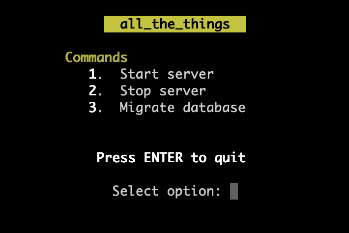
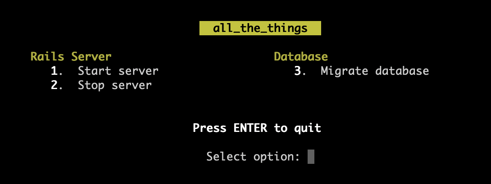
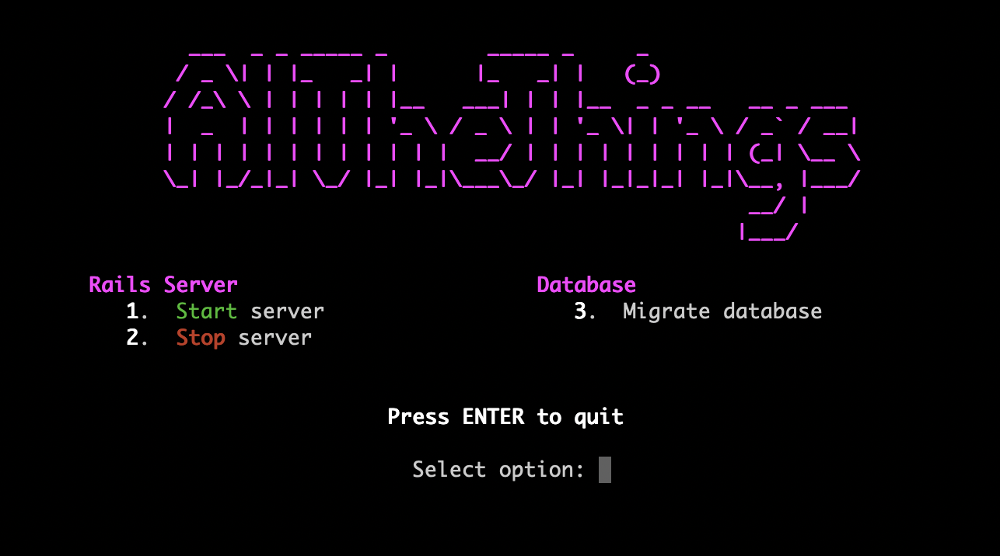

# MakeMenu

A Ruby gem to automatically create a number-selection text menu from an annotated Makefile.

### Installation

To install this gem locally, run the following command:

```ruby
gem install make_menu
```

Or, if you are using Bundler, add this line to your Gemfile:

```ruby
gem 'make_menu'
```

and run `bundle install`.

Once the gem is installed you can open a menu built from the Makefile in the current directory with the command:

```bash
ruby -r make_menu -e MakeMenu.run
```

### The Makefile

Although `make` is a build tool, I often use it for starting Rails applications. Here is an example Makefile
for a Rails application called **AllTheThings**:

```makefile
# ~/code/all_the_things/Makefile
.SILENT:

go:
	rails s > /dev/null &

stop:
	kill `cat tmp/pids/server.pid`

migrate:
	rake db:migrate
	rake db:test:prepare
    
console:
	rails c
	
```

I run these targets from the command line with `make go`, `make stop`, etc.

For MakeMenu to build a menu from this file we must annotate the targets with double-hash comments. We can also add
a default target (first target in file) which opens the menu, so we can open the menu with just `make`:

```makefile
# ~/code/all_the_things/Makefile
.SILENT:

menu:
	ruby -r make_menu -e MakeMenu.run
    
go: ## Start server
	rails s > /dev/null &

stop: ## Stop server
	kill `cat tmp/pids/server.pid`

migrate: ## Migrate database
	rake db:migrate
	rake db:test:prepare
    
console:
	rails c

```

MakeMenu will render this Makefile as:



Typing '3' and pressing ENTER will run the command `make migrate` and then return to the menu. Simply pressing ENTER
with no input will exit the menu.

Note that the `console` target does not appear in the menu because it is not annotated.

### Grouping targets

It is possible to split the targets into related groups by adding triple-hash comments on their own lines:

```makefile
# ~/code/all_the_things/Makefile
.SILENT:

menu:
	ruby -r make_menu -e MakeMenu.run
    
### Rails Server

go: ## Start server
	rails s > /dev/null &

stop: ## Stop server
	kill `cat tmp/pids/server.pid`

### Database

migrate: ## Migrate database
	rake db:migrate
	rake db:test:prepare
    
console:
	rails c

```

This will render as:



### Customisation

You can customise the appearance of the menu by creating your own class inheriting from `MakeMenu::Menu`. You specify
the name of your custom class through an environment variable called MENU.

For example:

```bash
MENU=Example ruby -r make_menu -e MakeMenu.run
```

This assumes a class called `ExampleMenu` is defined in the file `example_menu.rb` in the current directory.

Running this command in the `/examples` directory of this repository will render this menu:



See the example_menu.rb file to see how this is achieved.

### Happy making!


