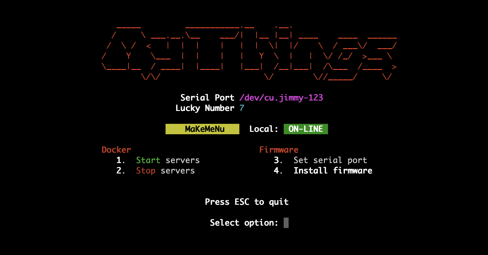

# Example

This is an example customisation for a MakeMenu. Open a terminal in this directory and run `make` and
you should see something like this:

### Make Targets

Options 1 and 2 simulate starting and stopping a server by creating or deleting the file `.server_pid`.

Option 3 allows the user to edit the value held in the file `.serial_port`, which is then used by Option 4.

### Menu Customisation

Hopefully the comments in the `Makefile` and the `tools/menu.rb` file explain what's going on here, but for a
general overview...

The menu prints some ASCII "art" at the top of the screen, and customises the general appearance of the menu. Note that
only the targets in the Makefile with `##` comments are displayed in the menu.

The menu adds two FIELDS. One displays the value read from the file `.serial_port` (or `[none]` if the file does
not exist). The other simply displays a random number on each menu re-draw.

The menu adds two BADGES. One displays either 'ON-LINE' or 'OFFLINE' depending on the presence of the file `.server_pid`.
The other simply displays some text which randomly switches colors on each menu re-draw.

